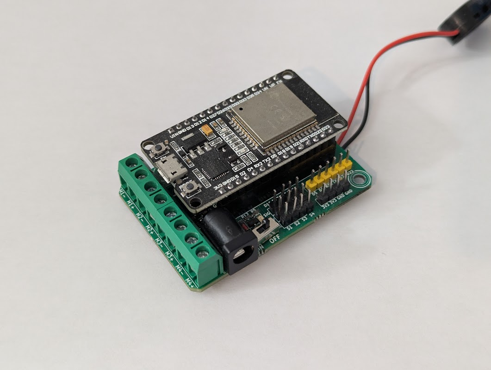
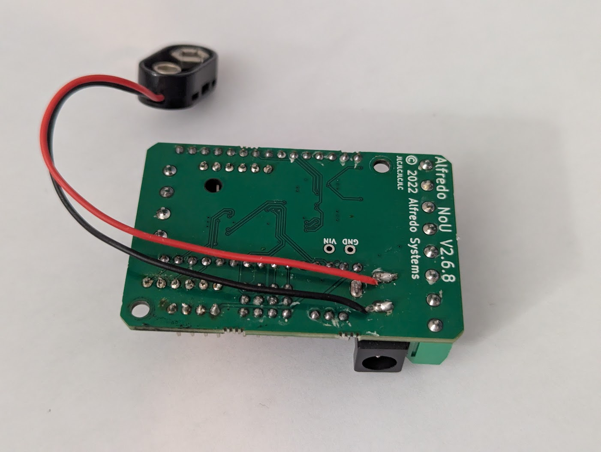
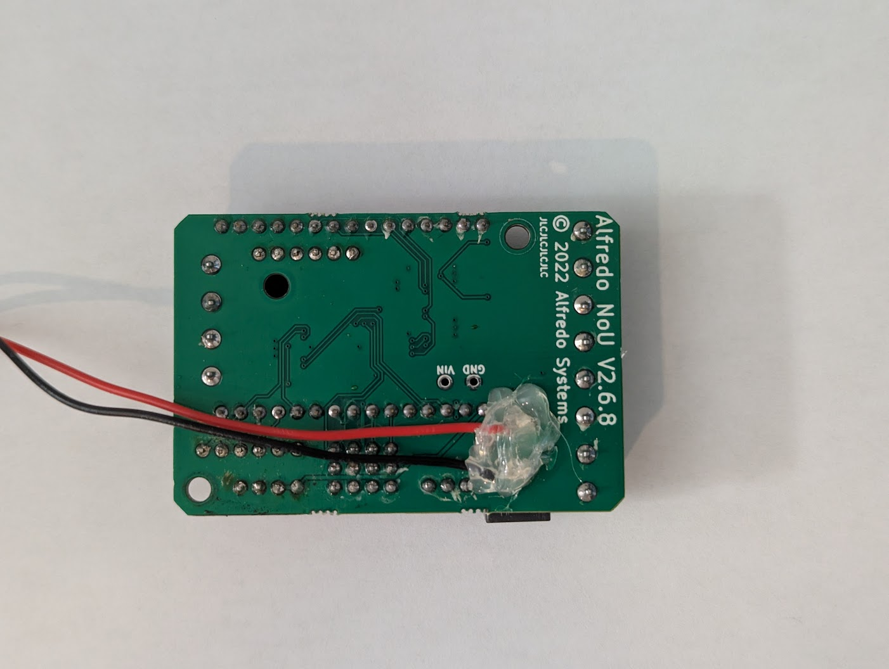
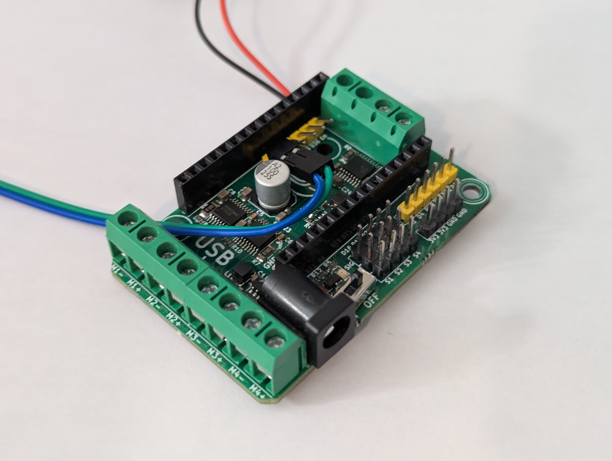
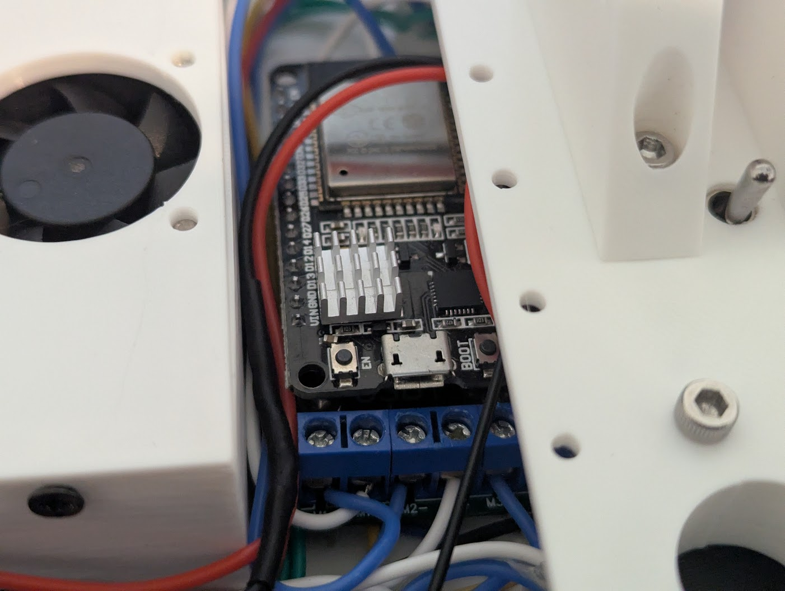

# NoU2 Robot Controller

<figure markdown>
{width=720}
*An ESP32 Dev Board atop a NoU2 shield.*
</figure>

The Alfredo Systems NoU2 is a motor shield for the ESP32 Dev Board.
It has been succeeded by the NoU3 and is no longer in production, but it is still very capeable and easy to use.

Primary documentation can be found on the [Alfredosys website](https://www.alfredosys.com/products/alfredo-nou2/).

## **Hardware summary**

- 6 DC Motor ports rated at 1A
- 4 Servo headers that share 3A
- 5 GPIO pins*
- 4 GPI pins

!!! note
    Two of the GPIO pins, 21 and 22, are overloaded. They can be used to drive motor 6, or they can be used as an I2C interface, or they can be used as regular GPIO, but not all at the same time!

## **Pinout summary**

- Pins 1 and 3 are broken out but are used by the ESP32's serial interface.
- Pin 2 is broken out on the auxillary GPIO and is also connected to the ESP32's onboard LED.
- Pins 4 and 5 are broken out and are true GPIO.
- Pins 21 and 22 are broken out and can be used to communicate with I2C devices like gyroscopes as long as you are not using a 6th motor.
- Pins 16, 17, 25, and 26 are used for servo signals 1 through 4 respectively, but can be used as GPIO if no servo is connected.

## **Safety**

!!! danger
    Do not leave the NoU2 powered via battery when programming it over USB. This causes the voltage regulator on the ESP32 to overheat to dangerous temperatures.
	
!!! danger
    Take extra care to install the ESP32 correctly, as it is easy to misalign the pins. If the board is powered on in this state it can cause permenant damage.

## **Modifications**

!!! warning
    Modification of the NoU2 could cause damage to yourself and/or the board. Proceed with caution!

### Barrel Jack Bypass

The Nou2 is typically powered by a 7.2V Doublepow Li-ion battery that connects via the barrel jack. The barrel jack plug is large and causes the NoU to have an awkward footprint. This mod involves soldering the power wires directly to the barrel jack.

<figure markdown>
{width=720}
*9V connector soldered directly to the barrel jack*
</figure>

<figure markdown>
{width=720}
*Make sure to add strain relief to prevent the wires from coming loose*
</figure>

### Auxillary Header

For those needing extra GPIO pins, the auxillary header provides access to GPIO pin 2 as well as GPI (input-only) pins 34, 35, 36, and 39. This also breaks out the Enable pin, which can be grounded to cause the ESP32 to reboot.

<figure markdown>
{width=720}
*With the header pins bent over, dupont connectors just barely fit beneath the ESP32*
</figure>

### ESP32 Heatsink

As mentioned in the safety warning, the voltage regulator on the ESP32 can get very hot. A heatsink can be added to help mitigate some of the risk.

<figure markdown>
{width=720}
*With the header pins bent over, dupont connectors just barely fit beneath the ESP32*
</figure>
