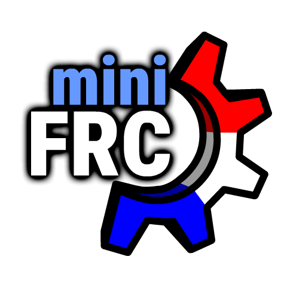

# Welcome to the **MiniFRC Wiki**
<figure markdown>
{width=400}
</figure>

MiniFRC is a robotics competition where teams compete in a quarter-scale version of the FIRST Robotics Competition. It is hosted regularly by the *TerrorBytes*, FRC team 4561.

This site is an unofficial collection of knowledge to help MiniFRC teams create their robots! Consider contributing on [GitHub.](https://github.com/ddthj/minifrc-com)

For the official MiniFRC webpage go [here.](https://www.terrorbytes.org/whatisminifrc)

For historical MiniFRC results go [here.](https://borc.io)
